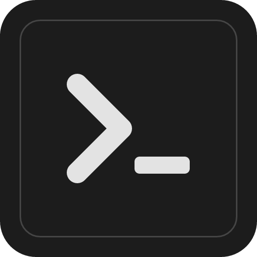

<div align="center">
  
  <h1>Steam Downgrader</h1>
  <p>Roll a Steam game back to an older version, and play it, even though Steam only ever installs the latest one.</p>
</div>

## What it does

Sometimes an update breaks a game, removes a feature, or nerfs something you liked.
Steam only keeps the newest version, so there is normally no way back. Steam
Downgrader gets an older build straight from Steam using your own account, and lets
you play it again.

With it you can:

- Browse your installed games, plus games you own but have not installed.
- Pick an older build by date and download it.
- Swap it into your game, or keep it as a separate copy you can launch.
- Keep every download in a library and switch between versions anytime.

It only works with games your own account owns, and it never bypasses any
protection. This is a Windows app.

## Tutorial

<div align="center">
  <a href="https://youtu.be/oV0TT6KsZQI">
    
  </a>
  <p><a href="https://youtu.be/oV0TT6KsZQI">Watch the tutorial on YouTube</a></p>
</div>

## Get it

1. Go to the [Releases page](https://github.com/FlazeIGuess/steam-downgrader/releases)
   and download the latest installer.
2. If there is no release yet, you can build it yourself (see
   [Build from source](#build-from-source) at the bottom).

## How to use it

Three steps:

1. Sign in to Steam. Scan the QR code with the Steam mobile app (easiest), or use
   your username and password. Your login goes straight to Steam and is never saved
   by the app.
2. Choose the build. Steam Downgrader lists builds by date for you: the current
   build plus older builds still cached on your PC. Pick one, or use "Go back one
   build" to jump to the version right before the last update. For a build that is
   not listed, open the depot on SteamDB, copy its manifest, and paste it in.
3. Download, then apply or play. Choose where to save it and download. Then either
   apply the build to your installed game, or launch the downloaded build directly.

Every download is saved under "your rollback versions", so you can launch it, apply
it, open its folder, or delete it at any time. The app also has a built-in help
panel that explains everything with small "?" tooltips.

## The two ways to apply a build

- Separate copy (recommended): keeps a frozen copy of the old build next to your
  game and adds it to Steam as a non-Steam shortcut. Your real game stays up to
  date, so online and multiplayer keep working.
- In-place freeze: replaces your installed game with the old build and turns off
  auto-update. For online games you may still need Steam's Offline Mode to stop it
  from updating back.

Deleting a version that you applied undoes it automatically: it removes the shortcut
and the frozen copy, or restores your original install.

## Good to know

- Best for singleplayer or offline play. Online games often reject old clients.
- Games with their own launcher or updater may patch themselves back up.
- Very old builds can be removed from Steam's servers and may no longer download.
- Your Steam login is sent only to Steam and is never stored by this app.

## Your data and privacy

Steam Downgrader has no backend of its own. It does not collect analytics, it has
no telemetry, and it never sends anything about you or your usage to the developer
or to any third party.

The only things that ever talk to the network are:

- Steam's own servers, through the official SteamKit2 library and the DepotDownloader
  engine, for signing in, reading your library, looking up builds, and downloading them.
- GitHub, to check whether a newer version of the app exists and to download the update.
- SteamDB is only ever opened as a normal link in your web browser. The app itself
  never contacts or scrapes SteamDB.

Your Steam login:

- You sign in with a QR code (scanned in the Steam mobile app) or with your username
  and password. These go straight to Steam through SteamKit2. Your password is never
  stored and never sent anywhere except Steam.
- After you sign in, Steam issues a login token (a refresh token, not your password).
  So downloads can run without asking you to sign in every time, this token is cached
  on your machine in a local account.config file. Deleting that file removes the
  cached login.

What is stored on your machine:

- The rollback library at `%APPDATA%\steam-downgrader\rollbacks.json`: the games and
  builds you downloaded (app ids, names, manifest ids, folder paths, and whether a
  build is applied). It contains no credentials.
- The game builds you download, in the folder you choose (by default a folder next to
  the game's install).
- A small setting for your preferred download folder.

Everything above stays on your computer. You can remove all of it at any time by
deleting the app, the `account.config` file, and the folders listed above.

## How it works

### Tech stack

- Desktop shell: Tauri 2, a Rust backend and a web frontend in one native window.
- Frontend: React and TypeScript, built with Vite.
- App logic: Rust, the commands that scan your Steam libraries, apply and revert
  builds, and manage the rollback library.
- Steam integration: a small .NET helper that uses SteamKit2 for login, ownership, and
  build information.
- Downloads: the DepotDownloader engine, compiled into the helper from a git submodule.
- Updates: the Tauri updater, with signed release artifacts.

### The pieces

Steam Downgrader is made of three parts, all running on your machine:

1. The window you see, built with React and TypeScript.
2. A Rust backend inside the same app that does the local work: scanning your Steam
   libraries, applying and reverting builds, and keeping the rollback library.
3. A small .NET helper process that speaks to Steam. The Rust backend and the helper
   talk over a local text channel (JSON over standard input and output). None of that
   channel goes over the network.

### What happens when you roll a game back

1. You sign in. The helper authenticates with Steam and receives a login token.
2. The app reads your installed and owned games, and the depots of the game you pick.
3. You pick the build by date from the in-app list (the current build plus builds
   cached on your PC), or paste a manifest from SteamDB for anything older.
4. The helper downloads exactly that build straight from Steam's content servers using
   the DepotDownloader engine, and the app shows live progress.
5. You either apply the build or launch it directly:
   - Separate copy: the build is copied into a frozen folder and added to Steam as a
     non-Steam shortcut, so your real install stays untouched.
   - In-place freeze: your install is moved aside as a backup, the old build is copied
     into its place, and auto-update is disabled in the app manifest.

Applying and reverting are plain local file operations (moving folders, patching the
appmanifest, and editing Steam's shortcuts file). Deleting an applied version undoes it
automatically. Every download is remembered in the rollback library, so you can launch,
re-apply, or delete it later.

## Build from source

<details>
<summary>Requirements, build steps, and how it works (for developers)</summary>

### Requirements

- Windows 10 or 11
- Steam installed, plus a Steam account that owns the games
- Rust (stable, 1.97 or newer) with the MSVC toolchain
- Node.js 18 or newer and npm
- .NET SDK 10 (for the helper process)
- The Tauri prerequisites (WebView2 is preinstalled on current Windows)

### Steps

Clone with submodules (the download engine is a git submodule):

```
git clone --recurse-submodules https://github.com/FlazeIGuess/steam-downgrader.git
cd steam-downgrader
```

Install and build:

```
npm install
cd steam-helper && dotnet build -c Debug && cd ..
npm run tauri dev
```

Build a release installer (build the helper in Release first):

```
cd steam-helper && dotnet build -c Release && cd ..
npm run tauri build
```

### Project layout

```
src/            React + TypeScript frontend
src-tauri/      Rust backend (Tauri commands, Steam integration, apply/revert)
steam-helper/   .NET helper (SteamKit2 + embedded DepotDownloader engine)
```

</details>

## Disclaimer

This project is not affiliated with, endorsed by, or associated with Valve
Corporation. Steam is a trademark of Valve Corporation.

Steam Downgrader is provided as is, without any warranty (see the license). You
use it at your own risk and are responsible for how you use it.

- It only downloads builds of games your own Steam account owns, using your own
  login. It does not bypass DRM or any copy protection.
- Rolling a game back is meant for singleplayer and offline use. Old or modified
  game files can be rejected online, and in games with anti-cheat (such as VAC)
  they may put your account at risk. Do not use downgraded builds in online or
  competitive games.
- Make sure your use follows the Steam Subscriber Agreement.

## License

Steam Downgrader is licensed under the GNU General Public License v2.0 (see
[LICENSE](LICENSE)). You are free to use and modify it, and every copy you pass on
must stay open source under the same license, so it cannot be turned into a
closed-source product. It bundles DepotDownloader (GPL-2.0) and uses SteamKit2
(LGPL-2.1).

## Credits

- [SteamRE/DepotDownloader](https://github.com/SteamRE/DepotDownloader)
- [SteamKit2](https://github.com/SteamRE/SteamKit)
- [SteamDB](https://steamdb.info) for the public build history
- [Tauri](https://tauri.app)
